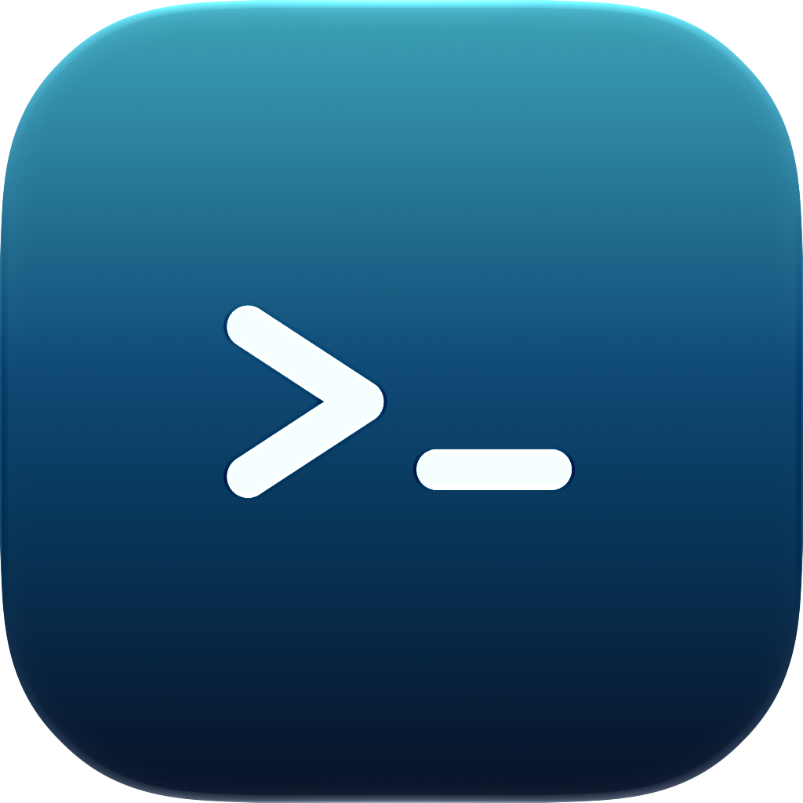

<p align="center">
  
</p>

<h1 align="center">Nauterm</h1>

<p align="center">
  A modern, cross-platform terminal and remote access workspace built with Flutter and Rust.
</p>

<p align="center">
  <a href="https://github.com/korvect/nauterm/releases"></a>
  <a href="https://github.com/korvect/nauterm/actions/workflows/quality-gates.yml"></a>
  <a href="LICENSE"></a>
  
</p>

<p align="center">
  English · <a href="README.zh-CN.md">简体中文</a>
</p>

Nauterm brings local terminals, remote connections, file transfer, port
forwarding, reusable commands, and encrypted synchronization into one desktop
application. Its interface is written in Flutter, while latency-sensitive
terminal, transport, database, and cryptographic operations run in a native
Rust layer.

Nauterm is inspired by the polished remote-access experience of Termius, with
the goal of building something better for developers who value transparent
local storage, stronger control over their data and sync providers, a native
high-performance core, and source access. Nauterm is an independent project
and is not affiliated with or endorsed by Termius.

> [!IMPORTANT]
> Nauterm is under active development. The `0.x` series may introduce breaking
> configuration or storage changes. Review the release notes before upgrading
> an important workstation. The current roadmap prioritizes improving existing
> functionality. New features will be added cautiously, with particular
> attention to their user value, maintenance cost, and impact on complexity.

## Highlights

### Terminal and connections

- Local shell sessions and saved remote hosts
- SSH, Mosh, Telnet, and serial connections
- Multiple terminal tabs, split panes, and workspace-oriented navigation
- SSH host key verification and a managed `known_hosts` file
- Password, private key, certificate, identity, proxy, and startup command
  configuration
- Local, remote, and dynamic SOCKS5 port forwarding

### Files and workflows

- Integrated SFTP browser and transfer queue
- Open selected remote files in a configured local editor
- Global, group, and host-scoped snippet packages
- Searchable shell history and optional encrypted terminal recording
- Configurable retention and storage limits for recorded sessions
- Built-in light and dark terminal themes with custom font and color controls

### Encrypted sync and backup

- GitHub repositories and private GitHub Gists
- S3-compatible object storage, such as Cloudflare R2, Backblaze B2,
  Wasabi, DigitalOcean Spaces, and self-hosted services
- WebDAV, Azure Blob Storage, Google Cloud Storage, Google Drive, OneDrive,
  and Dropbox
- Automatic synchronization, merge strategies, version history, and local
  pre-sync backups
- A user-supplied Master Key wraps the random Sync DEK; the Master Key itself
  is not persisted

> [!NOTE]
> Google Drive and Google Cloud Storage in official builds currently share a
> Google OAuth project that is pending verification and is limited to 100 OAuth
> users. After this limit is reached, new users cannot authorize either Google
> sync option until verification is completed. Other sync providers are not
> affected.

### Optional AI assistance

- Configurable OpenAI-compatible and Anthropic-compatible providers
- Terminal-aware conversations and command drafting
- Explicit review before a generated command is sent to a terminal

The AI functionality is an alpha feature and is disabled until a provider is
configured by the user.

## Platform support

| Platform | Architectures | Release formats |
| --- | --- | --- |
| macOS | Apple Silicon, Intel | DMG, application ZIP |
| Linux | x86_64, arm64 | AppImage (`.tar.gz`), DEB, RPM |
| Windows | x86_64, arm64 | Inno Setup installer, portable ZIP |

Nauterm is currently a desktop application. Android, iOS, and web builds are
not supported.

## Roadmap

- [ ] Ghostty terminal emulation backend (`libghostty-vt`)
- [ ] SFTP multithreaded, chunked transfer with resume
- [ ] Predictive local echo
- [ ] Session and window restoration after restart
- [ ] Import hosts from Tabby
- [ ] Unified Capability Registry exposed via MCP to external agents and the built-in AI assistant

## Installation

Download the package for your platform from the
[latest GitHub release](https://github.com/korvect/nauterm/releases/latest).
Every tagged release includes a `SHA256SUMS.txt` file for verifying downloaded
artifacts.

The AppImage is distributed inside a `.tar.gz` archive so its executable
permission survives download. Extract the archive before running the AppImage.

On macOS, Nauterm can update through Sparkle. Windows and Linux builds can
discover compatible packages from GitHub Releases and verify downloads against
the published checksum manifest.

## Getting started

1. Open Nauterm and create a local or remote host.
2. For SSH, provide the address, username, and an authentication method.
3. Review the server fingerprint before saving a new host key.
4. Open a terminal, SFTP session, or port forward from the saved host.
5. Optionally configure encrypted sync under **Settings → Sync & Backup**.

Mosh requires a compatible `mosh-server` on the remote host. Telnet does not
encrypt network traffic and should only be used on a trusted network or through
another secure transport.

## Security model

Nauterm is designed so that stored credentials and synchronized data are not
kept as plaintext:

- The local SQLite database is encrypted with SQLCipher.
- Its random database key is stored in macOS Keychain, Windows Credential
  Manager, or a Linux Secret Service implementation.
- Connection and cloud-provider credentials live inside the encrypted
  database.
- Optional terminal captures are encrypted before being written to disk.
- Sync providers receive an encrypted payload. A random Sync DEK encrypts the
  data, and the user's Master Key is used only to wrap or unwrap that DEK.

No security model can protect a running, unlocked process from a compromised
operating system. Keep the operating system, credential store, and remote
servers secured and up to date.

Please do not include credentials, private keys, database files, or raw
terminal captures in public bug reports.

## Minimal usage analytics

Official builds send a small set of startup events to PostHog so the project
can measure first launches and daily or weekly active installations:

- `first_open` is sent once, with the first-launch timestamp.
- `$screen` and `app_started` are sent when Nauterm starts.
- Events include a random, persistent Nauterm installation identifier, the
  operating system, application name and identifier, version, build number,
  and event timestamp.

The installation identifier is generated by Nauterm and is not a hardware
identifier, account name, or email address. Nauterm does not send host
addresses, usernames, terminal content, commands, files, credentials, sync
payloads, AI conversations, or application logs as analytics. PostHog GeoIP
enrichment is disabled, so city, coordinates, postal code, and timezone are
not derived from the request IP. Builds without `NAUTERM_POSTHOG_API_KEY` do
not send these events.

## Building from source

### Prerequisites

- Flutter `3.44.6`
- Rust `1.97.0` with `rustfmt` and `clippy`
- Git, CMake, and the native desktop toolchain for the target platform
- Platform dependencies required by Flutter desktop

Linux development additionally requires `pkg-config` and the D-Bus development
headers:

```sh
sudo apt install pkg-config libdbus-1-dev
```

Clone the repository and resolve Flutter dependencies:

```sh
git clone https://github.com/korvect/nauterm.git
cd nauterm
flutter pub get
```

The repository contains pinned prebuilt Mosh libraries. Select the directory
for the current platform before running the application.

macOS:

```sh
export NAUTERM_MOSH_LIB_DIR="$PWD/third_party/nauterm_mosh_ffi/macos-$(uname -m)"
make run
```

Linux x86_64:

```sh
export NAUTERM_MOSH_LIB_DIR="$PWD/third_party/nauterm_mosh_ffi/linux-x86_64"
make run
```

Developers working on Mosh itself can instead place the `nauterm-mosh`
workspace next to this repository or set `NAUTERM_MOSH_REPO_DIR` explicitly.

### Local build configuration

Optional compile-time configuration can be placed in the ignored
`.env.build.local` file using unquoted `NAME=value` lines:

```dotenv
NAUTERM_UPDATE_REPOSITORY=korvect/nauterm
NAUTERM_GITHUB_CLIENT_ID=
NAUTERM_GOOGLE_CLIENT_ID=
NAUTERM_GOOGLE_CLIENT_SECRET=
NAUTERM_ONEDRIVE_CLIENT_ID=
NAUTERM_DROPBOX_CLIENT_ID=
NAUTERM_POSTHOG_API_KEY=
NAUTERM_POSTHOG_HOST=
```

| Variable | Purpose |
| --- | --- |
| `NAUTERM_UPDATE_REPOSITORY` | GitHub repository used for application updates |
| `NAUTERM_GITHUB_CLIENT_ID` | GitHub Device Flow client for Gist sync |
| `NAUTERM_GOOGLE_CLIENT_ID` | Desktop OAuth client shared by Google Drive and Google Cloud Storage |
| `NAUTERM_GOOGLE_CLIENT_SECRET` | Optional Google OAuth secret for clients that require one |
| `NAUTERM_ONEDRIVE_CLIENT_ID` | OneDrive OAuth application client |
| `NAUTERM_DROPBOX_CLIENT_ID` | Dropbox OAuth application client |
| `NAUTERM_POSTHOG_API_KEY` | Optional PostHog project API key; analytics remain disabled when empty. Events are sent via the PostHog capture REST API, so macOS, Windows, and Linux are all supported |
| `NAUTERM_POSTHOG_HOST` | Optional PostHog instance host (defaults to PostHog US cloud) |

These identifiers are compiled into the application. Do not place private
signing keys or unrelated service credentials in Dart defines.

For tagged GitHub builds, configure the PostHog values as repository Actions
variables with the same names. The PostHog project API key is a public project
token, not a personal API key.

### Common commands

```sh
# Run the desktop app
make run

# Build the Rust library explicitly
make native-debug
make native-release

# Build packages for the current platform
make package-current

# Regenerate platform icons after editing the canonical sources
make generate-icons
make verify-icons
```

Native compilation is integrated into the macOS Xcode, Linux CMake, and Windows
packaging pipelines. The explicit native targets are mainly useful while
working directly on the Rust layer.

## Tests and quality checks

Run the checks relevant to a change before opening a pull request:

```sh
dart format --output=none --set-exit-if-changed lib test test_integration
flutter analyze
flutter test

cargo fmt --manifest-path native/nauterm_ffi/Cargo.toml --all -- --check
cargo clippy \
  --manifest-path native/nauterm_ffi/Cargo.toml \
  --all-targets --locked -- -D warnings
cargo test \
  --manifest-path native/nauterm_ffi/Cargo.toml \
  --locked --features test-credential-store
```

The **Quality Gates** workflow can also be started manually from GitHub
Actions. Its standard run checks Flutter, Rust, release metadata, generated
assets, licenses, and the Mosh ABI on Linux. The optional integration run adds
desktop integration tests on Linux, macOS, and Windows.

Normal pushes to `main` do not automatically consume CI minutes. Tags matching
`v*` run quality checks, build release packages, generate checksums, and publish
a GitHub release.

## Project structure

| Path | Responsibility |
| --- | --- |
| `lib/` | Flutter application, settings, workspace, terminal UI, and FFI bindings |
| `native/nauterm_ffi/` | Rust database, cryptography, terminal, SSH, serial, sync, and transport implementation |
| `assets/` | Localization, themes, icons, presets, and third-party notices |
| `macos/`, `linux/`, `windows/` | Desktop runners and platform build integration |
| `scripts/` | Local development, asset generation, packaging, and CI utilities |
| `third_party/` | Vendored source and verified native artifacts |
| `test/` | Flutter unit and widget tests |
| `test_integration/` | Cross-platform terminal and native integration tests |

The native terminal engine uses `alacritty_terminal` for emulation. Rust owns
PTY and transport work, then exposes snapshots and commands to Dart through a
small FFI boundary. The Mosh implementation is maintained in the separately
versioned `nauterm-mosh` repository; this repository pins its source revision
and verifies the bundled library checksums and ABI.

## Acknowledgements

Nauterm would not be possible without these excellent open-source projects:

- [NativeAPI](https://github.com/libnativeapi/nativeapi-flutter) — native
  desktop integration for Flutter
- [alacritty_terminal](https://github.com/alacritty/alacritty) — terminal
  emulation
- [lucide_icons_flutter](https://github.com/vqh2602/lucide-flutter-main) —
  Lucide icons for Flutter
- [flutter_markdown_plus](https://github.com/foresightmobile/flutter_markdown_plus)
  — Markdown rendering for Flutter
- [Russh](https://github.com/warp-tech/russh) — SSH protocol implementation
  in Rust
- [russh-sftp](https://github.com/AspectUnk/russh-sftp) — SFTP protocol support
  for Russh
- [rusqlite](https://github.com/rusqlite/rusqlite) — SQLite bindings and
  SQLCipher integration
- [keyring-rs](https://github.com/hwchen/keyring-rs) — native operating-system
  credential storage
- [Apache OpenDAL](https://github.com/apache/opendal) — unified access to cloud
  storage services

Our sincere thanks to their maintainers and contributors.

## Contributing

Bug reports, focused pull requests, and suggestions that improve existing
functionality are welcome. Useful contributions include correctness,
usability, accessibility, performance, reliability, security, platform
compatibility, localization, tests, and documentation.

Nauterm prioritizes refining its existing capabilities. New features are
considered cautiously and should provide clear user value without introducing
disproportionate complexity or maintenance cost. Larger proposals may be
deferred while the existing experience is stabilized.

1. Search existing issues before opening a new one.
2. Prefer improvements to existing Nauterm capabilities; explain the value and
   long-term cost of any new feature proposal.
3. Keep changes scoped and add regression coverage for behavioral fixes.
4. Run formatting, analysis, and the relevant Flutter and Rust tests.
5. Explain user-visible changes, compatibility impact, and platform-specific
   behavior in the pull request.

Use the repository's
[issue tracker](https://github.com/korvect/nauterm/issues) for reproducible bug
reports, improvement proposals, and carefully scoped feature discussions.

## License

Nauterm is distributed under the
[MIT License with Commons Clause License Condition v1.0](LICENSE).

You may use, inspect, modify, and redistribute the source under those terms,
but the Commons Clause restricts selling a product or service whose value
derives substantially from Nauterm. This is a **source-available license, not
an OSI-approved open-source license**. Review the complete license before
redistributing Nauterm or using it commercially.
