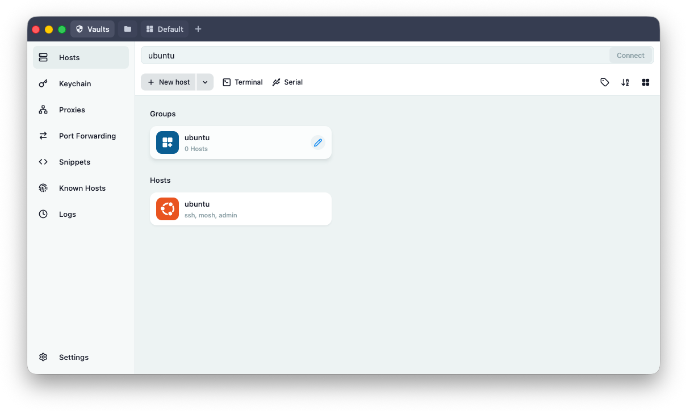
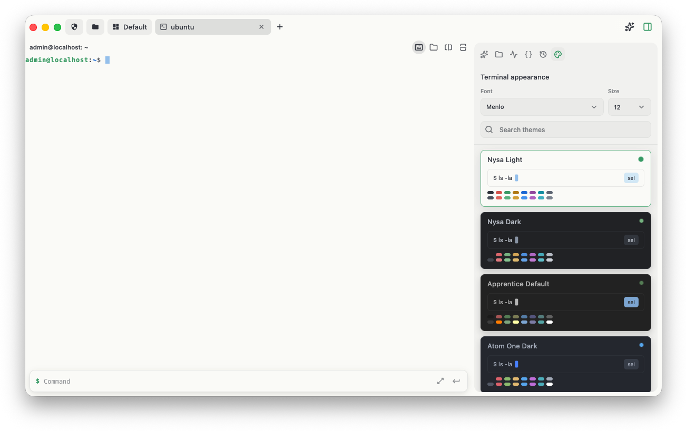
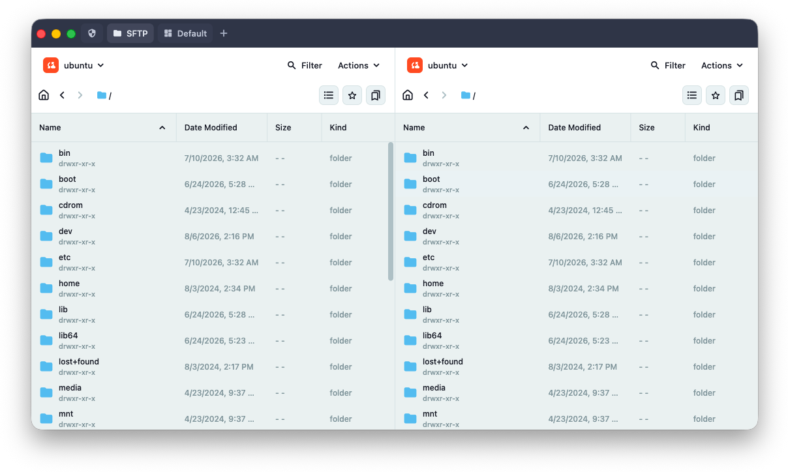
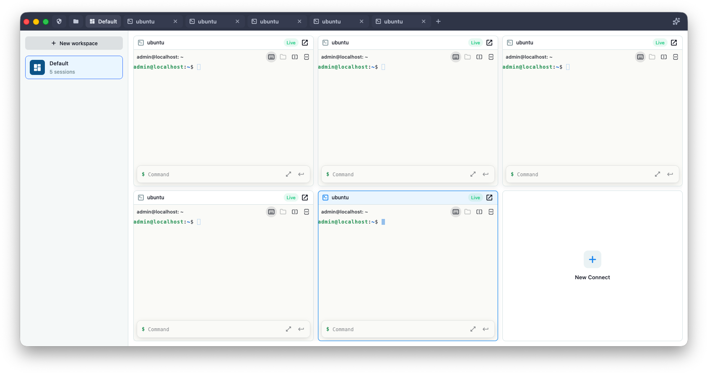

<p align="center">
  
</p>

<h1 align="center">Nauterm</h1>

<p align="center">
  使用 Flutter 与 Rust 构建的现代跨平台终端和远程访问工作空间。
</p>

<p align="center">
  <a href="https://github.com/korvect/nauterm/releases"></a>
  <a href="LICENSE"></a>
  
</p>

<p align="center">
  <a href="README.md">English</a> · 简体中文
</p>

Nauterm 将本地终端、远程连接、文件传输、端口转发、可复用命令和加密同步整合到一个桌面应用中。界面使用 Flutter 编写，对延迟敏感的终端、传输、数据库和密码学操作则由原生 Rust 层负责。

Nauterm 受到 Termius 精致远程访问体验的启发，目标是为重视透明本地存储、数据和同步服务控制权、原生高性能核心以及源码访问的开发者打造更好的工具。Nauterm 是独立项目，与 Termius 不存在关联，也未获得其认可或背书。

> [!IMPORTANT]
> Nauterm 仍处于积极开发阶段。`0.x` 系列可能会引入配置或存储方面的不兼容变更。在重要工作站上升级前，请先阅读版本说明。当前路线图优先改进现有功能；新增功能会谨慎评估，并重点考虑用户价值、维护成本和复杂度影响。

## 主要特点

### 终端与连接

- 本地 Shell 会话和已保存的远程主机
- SSH、Mosh、Telnet 和串口连接
- 多终端标签、分屏以及面向工作空间的导航
- 针对高延迟 SSH 连接的自适应本地预测回显
- SSH 主机密钥验证和托管的 `known_hosts` 文件
- 密码、私钥、证书、身份、代理和启动命令配置
- 本地、远程和动态 SOCKS5 端口转发

### 文件与工作流

- 集成的 SFTP 文件浏览器，支持并发、分片和断点续传
- 使用配置的本地编辑器打开选中的远程文件
- 支持从 CSV、OpenSSH、PuTTY、MobaXterm 和 SecureCRT 导入主机
- 支持全局、分组和主机作用域的命令片段包
- 可搜索的 Shell 历史和可选的加密终端录制
- 可配置的录制保留时间与存储上限
- 内置明暗终端主题，以及自定义字体和颜色控制

### 加密同步与备份

- GitHub 仓库和私有 GitHub Gist
- S3 兼容对象存储，例如 Cloudflare R2、Backblaze B2、Wasabi、
  DigitalOcean Spaces 以及自托管服务
- WebDAV、Azure Blob Storage、Google Cloud Storage、Google Drive、OneDrive 和 Dropbox
- 自动同步、合并策略、版本历史以及同步前本地备份
- 用户提供的主密钥用于封装随机同步 DEK；主密钥本身不会被持久化

> [!NOTE]
> 官方构建中的 Google Drive 和 Google Cloud Storage 当前共用一个尚待验证的 Google OAuth 项目，现阶段最多支持 100 位 OAuth 用户。达到上限后，在验证完成前，新用户将无法授权这两种 Google 同步方式。其他同步服务不受影响。

### 可选 AI 助手

- 可配置 OpenAI 兼容和 Anthropic 兼容服务
- 感知终端上下文的对话和命令草拟
- 生成的命令发送到终端前需要明确审核

AI 功能目前处于 Alpha 阶段，只有用户配置服务后才会启用。

## 截图






## 平台支持

| 平台 | 架构 | 发布格式 |
| --- | --- | --- |
| macOS | Apple Silicon、Intel | DMG、应用 ZIP |
| Linux | x86_64、arm64 | AppImage（`.tar.gz`）、DEB、RPM |
| Windows | x86_64、arm64 | Inno Setup 安装程序、便携 ZIP |

Nauterm 当前仅支持桌面平台，不支持 Android、iOS 和 Web 构建。

## 路线图

- [x] 基于 libghostty-vt 的终端仿真后端（`libghostty-vt`）
- [x] SFTP 多线程、分片、可断点续传的传输
- [x] SSH 本地预测回显
- [x] 重启后恢复工作区布局与可重连会话
- [ ] 构建统一的 Capability Registry，通过 MCP 面向外部 Agent 及内部 AI 助手开放

## 安装

### macOS（Homebrew）

```sh
brew install --cask korvect/nauterm/nauterm
```

也可以先添加 tap：

```sh
brew tap korvect/nauterm
brew install --cask nauterm
```

升级和卸载分别使用 `brew upgrade --cask nauterm` 和 `brew uninstall --cask nauterm`。通过 Homebrew 安装后，请继续使用 Homebrew 升级，以保证已安装版本与 cask 保持一致。

### 手动下载

从 [GitHub 最新版本](https://github.com/korvect/nauterm/releases/latest) 下载对应平台的软件包。每个标签版本都包含 `SHA256SUMS.txt`，可用于验证下载的构建产物。

AppImage 使用 `.tar.gz` 压缩包发布，以便在下载后保留可执行权限；使用前请先解压。

在 macOS 上，Nauterm 可以通过 Sparkle 更新。Windows 和 Linux 版本可以从 GitHub Releases 发现兼容软件包，并使用发布的校验和清单验证下载内容。

## 快速开始

1. 打开 Nauterm，创建本地主机或远程主机。
2. 使用 SSH 时，填写地址、用户名和认证方式。
3. 保存新的主机密钥前，请先核对服务器指纹。
4. 从已保存的主机打开终端、SFTP 会话或端口转发。
5. 如有需要，在 **设置 → 同步与备份** 中配置加密同步。

Mosh 要求远程主机安装兼容的 `mosh-server`。Telnet 不会加密网络流量，只应在受信任网络中使用，或通过其他安全传输使用。

## 安全模型

Nauterm 的设计目标是避免以明文保存凭据和同步数据：

- 本地 SQLite 数据库使用 SQLCipher 加密。
- 随机数据库密钥保存在 macOS Keychain、Windows Credential Manager 或 Linux Secret Service 实现中。
- 连接凭据和云服务凭据存储在加密数据库中。
- 可选的终端录制会在写入磁盘前加密。
- 同步服务收到的是加密负载。数据由随机同步 DEK 加密，用户主密钥仅用于封装或解封该 DEK。

任何安全模型都无法在操作系统已经失陷时保护正在运行且已解锁的进程。请及时更新并保护操作系统、系统凭据存储和远程服务器。

提交公开 Bug 报告时，请勿附带凭据、私钥、数据库文件或原始终端录制。

## 最小化使用分析

官方构建会向 PostHog 发送少量启动事件，用于统计首次启动以及每日或每周活跃安装量：

- `first_open` 仅发送一次，包含首次启动时间。
- Nauterm 启动时发送 `$screen` 和 `app_started`。
- 事件包含 Nauterm 随机生成并持久保存的安装标识符、操作系统、应用名称与标识符、版本号、构建号和事件时间。

该安装标识符不是硬件标识符、账户名或电子邮件地址。Nauterm 不会将主机地址、用户名、终端内容、命令、文件、凭据、同步负载、AI 对话或应用日志作为分析数据发送。所有事件都会禁用 PostHog GeoIP 丰富，因此不会根据请求 IP 推导城市、经纬度、邮编或时区。未配置 `NAUTERM_POSTHOG_API_KEY` 的构建不会发送这些事件。

## 从源码构建

### 前置条件

- Flutter `3.47.0`
- Rust `1.97.0`，并安装 `rustfmt` 和 `clippy`
- Zig `0.16.0`，用于构建固定版本的 `libghostty-vt`
- Git、CMake 以及目标平台的原生桌面工具链
- Flutter 桌面开发所需的平台依赖

Linux 开发还需要 `pkg-config` 和 D-Bus 开发头文件：

```sh
sudo apt install pkg-config libdbus-1-dev
```

克隆仓库并解析 Flutter 依赖：

```sh
git clone --recurse-submodules https://github.com/korvect/nauterm.git
cd nauterm
flutter pub get
```

仓库包含固定版本的预编译 Mosh 库。运行应用前，请选择当前平台对应的目录。

macOS：

```sh
export NAUTERM_MOSH_LIB_DIR="$PWD/third_party/nauterm_mosh_ffi/macos-$(uname -m)"
make run
```

Linux x86_64：

```sh
export NAUTERM_MOSH_LIB_DIR="$PWD/third_party/nauterm_mosh_ffi/linux-x86_64"
make run
```

参与 Mosh 本身开发时，可以将 `nauterm-mosh` 工作空间放在本仓库同级目录，或显式设置 `NAUTERM_MOSH_REPO_DIR`。

### 本地构建配置

可选的编译时配置可以写入已被 Git 忽略的 `.env.build.local` 文件。每行使用不带引号的 `NAME=value` 格式：

```dotenv
NAUTERM_UPDATE_REPOSITORY=korvect/nauterm
NAUTERM_GITHUB_CLIENT_ID=
NAUTERM_GOOGLE_CLIENT_ID=
NAUTERM_GOOGLE_CLIENT_SECRET=
NAUTERM_ONEDRIVE_CLIENT_ID=
NAUTERM_DROPBOX_CLIENT_ID=
NAUTERM_POSTHOG_API_KEY=
NAUTERM_POSTHOG_HOST=
```

| 变量 | 用途 |
| --- | --- |
| `NAUTERM_UPDATE_REPOSITORY` | 用于应用更新的 GitHub 仓库 |
| `NAUTERM_GITHUB_CLIENT_ID` | 用于 Gist 同步的 GitHub Device Flow 客户端 |
| `NAUTERM_GOOGLE_CLIENT_ID` | Google Drive 和 Google Cloud Storage 共用的桌面 OAuth 客户端 |
| `NAUTERM_GOOGLE_CLIENT_SECRET` | 某些 Google 客户端需要的可选 OAuth Secret |
| `NAUTERM_ONEDRIVE_CLIENT_ID` | OneDrive OAuth 应用客户端 |
| `NAUTERM_DROPBOX_CLIENT_ID` | Dropbox OAuth 应用客户端 |
| `NAUTERM_POSTHOG_API_KEY` | 可选 PostHog 项目 API Key；留空时禁用分析。事件通过 PostHog capture REST API 上报，macOS、Windows、Linux 三端均支持 |
| `NAUTERM_POSTHOG_HOST` | 可选 PostHog 实例地址（默认 PostHog 美国云） |

这些标识会被编译进应用。不要通过 Dart Define 传入私有签名密钥或无关的服务凭据。

GitHub 标签构建需要在仓库 Actions Variables 中配置同名的 PostHog 变量。这里应使用公开的 PostHog Project API Key，而不是 Personal API Key。

### 常用命令

```sh
# 运行桌面应用
make run

# 显式构建 Rust 库
make native-debug
make native-release

# 为当前平台构建软件包
make package-current

# 编辑规范图标源后重新生成平台图标
make generate-icons
make verify-icons
```

原生编译已经集成到 macOS Xcode、Linux CMake 和 Windows 打包流程中。显式原生构建目标主要用于直接开发 Rust 层。

## 测试与质量检查

提交 Pull Request 前，请运行与改动相关的检查：

```sh
dart format --output=none --set-exit-if-changed lib test test_integration
flutter analyze
flutter test

cargo fmt --manifest-path native/nauterm_ffi/Cargo.toml --all -- --check
cargo clippy \
  --manifest-path native/nauterm_ffi/Cargo.toml \
  --all-targets --locked -- -D warnings
cargo test \
  --manifest-path native/nauterm_ffi/Cargo.toml \
  --locked --features test-credential-store
```

也可以从 GitHub Actions 手动启动 **Quality Gates** 工作流。标准运行会在 Linux 上检查 Flutter、Rust、发布元数据、生成资源、许可证和 Mosh ABI。启用可选集成检查后，还会在 Linux、macOS 和 Windows 上运行桌面集成测试。

普通推送到 `main` 不会自动消耗 CI 分钟数。匹配 `v*` 的标签会运行质量检查、构建发布包、生成校验和并发布 GitHub Release。

## 项目结构

| 路径 | 职责 |
| --- | --- |
| `lib/` | Flutter 应用、设置、工作空间、终端 UI 和 FFI 绑定 |
| `native/nauterm_ffi/` | Rust 数据库、密码学、终端、SSH、串口、同步和传输实现 |
| `assets/` | 本地化、主题、图标、预设和第三方声明 |
| `macos/`、`linux/`、`windows/` | 桌面 Runner 和平台构建集成 |
| `scripts/` | 本地开发、资源生成、打包和 CI 工具 |
| `third_party/` | 随附源码和经过验证的原生构建产物 |
| `test/` | Flutter 单元测试和 Widget 测试 |
| `test_integration/` | 跨平台终端和原生集成测试 |

原生终端层同时支持 `alacritty_terminal` 和固定版本的 `libghostty-vt` 子模块。每个会话都在专属单线程 actor 内独占所选择的仿真引擎，Dart 通过精简的 FFI 边界与其通信；Ghostty 会话还支持渲染 Kitty Graphics Protocol 图像。Mosh 实现在独立版本管理的 `nauterm-mosh` 仓库中维护；本仓库会固定其源码版本，并验证随附库的校验和与 ABI。

## 致谢

如果没有以下优秀的开源项目，Nauterm 将无法实现：

- [NativeAPI](https://github.com/libnativeapi/nativeapi-flutter) — Flutter 原生桌面集成
- [alacritty_terminal](https://github.com/alacritty/alacritty) — 终端仿真
- [libghostty-vt](https://github.com/ghostty-org/ghostty) — 可选终端仿真与 Kitty 图像支持
- [lucide_icons_flutter](https://github.com/vqh2602/lucide-flutter-main) — Flutter Lucide 图标
- [flutter_markdown_plus](https://github.com/foresightmobile/flutter_markdown_plus) — Flutter Markdown 渲染
- [Russh](https://github.com/warp-tech/russh) — Rust SSH 协议实现
- [russh-sftp](https://github.com/AspectUnk/russh-sftp) — Russh 的 SFTP 协议支持
- [rusqlite](https://github.com/rusqlite/rusqlite) — SQLite 绑定和 SQLCipher 集成
- [keyring-rs](https://github.com/hwchen/keyring-rs) — 操作系统原生凭据存储
- [Apache OpenDAL](https://github.com/apache/opendal) — 统一访问云存储服务

衷心感谢这些项目的维护者和贡献者。

## 贡献

欢迎提交 Bug 报告、范围明确的 Pull Request，以及针对现有功能的改进建议。适合的贡献包括正确性、可用性、无障碍体验、性能、可靠性、安全性、平台兼容性、本地化、测试和文档改进。

Nauterm 优先完善现有能力。新增功能会谨慎评估，应当带来明确的用户价值，同时避免引入不成比例的复杂度和维护成本。在现有体验稳定之前，较大的提案可能会延期处理。

1. 创建 Issue 前先搜索已有 Issue。
2. 优先改进 Nauterm 的现有能力；如建议新增功能，请说明其价值和长期维护成本。
3. 保持改动范围集中，并为行为修复添加回归测试。
4. 运行格式化、静态分析以及相关 Flutter 和 Rust 测试。
5. 在 Pull Request 中说明用户可见变更、兼容性影响和平台特定行为。

请使用仓库的 [Issue Tracker](https://github.com/korvect/nauterm/issues) 提交可复现的 Bug 报告、改进建议，以及范围明确的新功能讨论。

## 许可证

Nauterm 使用 [MIT License with Commons Clause License Condition v1.0](LICENSE) 分发。

你可以在该许可证条款下使用、查看、修改和重新分发源码，但 Commons Clause 限制销售其价值主要来源于 Nauterm 的产品或服务。这是**源码可用许可证，不是 OSI 认可的开源许可证**。重新分发 Nauterm 或将其用于商业用途前，请阅读完整许可证。
